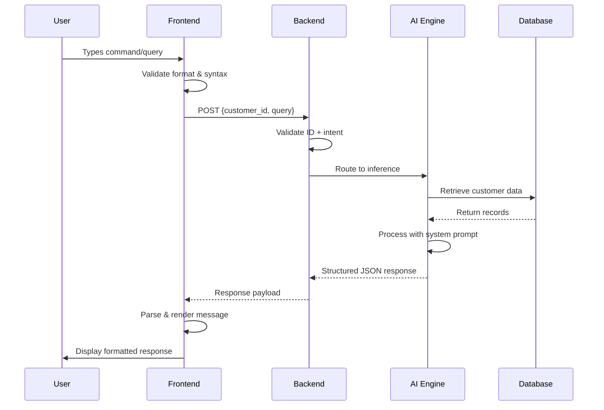

# Terminal Agent Page - Design & Implementation Guide

## 🎯 Overview

This document outlines the design and implementation specifications for the **Banking Assistant Terminal Interface** — a futuristic, developer-console-style AI agent interaction page that allows users to query banking information through a command-line interface.

---

## 🧭 1. Concept & Purpose

### What It Is
A **terminal-agentic interface** that simulates a professional developer console where users communicate with an AI Banking Assistant through structured commands and natural language queries.

### Core Philosophy
- **Professional & Minimal**: Clean, focused interface without unnecessary UI chrome
- **Intelligent Validation**: Frontend validates before backend processing
- **Contextual Responses**: AI provides structured, relevant banking information
- **Developer-Like Experience**: Familiar to technical users, impressive to stakeholders

### Use Case
Query Shawbrook Banking data (ISA maturity dates, account information, product details) through an AI assistant that understands natural language while maintaining strict domain boundaries.

---

## 🧩 2. Interaction Flow (User → System → Agent)



### Step-by-Step Flow

| Step | Actor | Action | Response |
|------|-------|--------|----------|
| **1** | User | Types command: `> query --id 105 "When does my ISA mature?"` | Frontend validates format |
| **2** | Frontend | Sends POST: `{customer_id: 105, query: "When does my ISA mature?"}` | Loading animation displays |
| **3** | Backend | Validates ID + intent, routes to AI | Logs request, starts inference |
| **4** | AI Engine | Interprets query, retrieves data, formulates response | Returns structured JSON |
| **5** | Frontend | Parses and renders: `[ASSISTANT] Your ISA matures on 14 March 2026.` | Smooth scroll, timestamped entry |
| **6** | (Safety) | If invalid/out-of-domain query | `[ERROR] Invalid query or out-of-domain question.` |

---

## ⚙️ 3. Command Syntax & Examples

### Structured Command Format

```bash
> query --id <customer_id> "<natural_language_question>"
```

### Supported Commands

| Command | Syntax | Description |
|---------|--------|-------------|
| **query** | `> query --id 123 "When can I withdraw?"` | Ask banking questions for specific customer |
| **info** | `> info --products` | List available product information |
| **help** | `> help` | Display all available commands |
| **clear** | `> clear` | Clear terminal history |
| **exit** | `> exit` | End session (optional) |

### Natural Language Support

If user previously specified an ID, allow plain text queries:

```bash
> query --id 123 "When does my ISA mature?"
[ASSISTANT] Your ISA matures on 14 March 2026.

> "Can I withdraw funds now?"
[ASSISTANT] Withdrawals are not permitted before maturity date.
```

### Invalid Query Examples

```bash
> query --id 123 "Write me a Python bubble sort"
[ERROR] Sorry, I can only assist with Shawbrook account and product queries.

> query --id 999999 "Show my balance"
[ERROR] Invalid customer ID. Please verify and try again.
```

---

## 🎨 4. Visual Design Specifications

### Color Scheme (Theme-Aware)

#### Dark Theme
- **Background**: `#0a0e27` (deep navy, matching loading screen)
- **Terminal Container**: `rgba(20, 24, 45, 0.95)` (semi-transparent dark)
- **Border/Accent**: Gradient cyan → purple → gold
- **Text Colors**:
  - System messages: `#06b6d4` (cyan)
  - User commands: `#ffffff` (white)
  - Assistant responses: `#fbbf24` (gold)
  - Errors: `#ef4444` (red)
  - Logs: `#6b7280` (gray)

#### Light Theme
- **Background**: `#fafafa` (soft white)
- **Terminal Container**: `rgba(255, 255, 255, 0.95)` (semi-transparent white)
- **Border/Accent**: Gradient orange → amber → gold
- **Text Colors**:
  - System messages: `#ea580c` (orange)
  - User commands: `#1f2937` (dark gray)
  - Assistant responses: `#d97706` (dark orange)
  - Errors: `#dc2626` (red)
  - Logs: `#9ca3af` (light gray)

### Typography

```css
font-family: 'Courier New', 'IBM Plex Mono', 'Fira Code', monospace;
font-size: 14px;
line-height: 1.6;
letter-spacing: 0.02em;
```

### Layout Structure

```
┌─────────────────────────────────────────────────────────────┐
│  [BANKING ASSISTANT] Terminal v1.0          [Theme] [Help]  │
├─────────────────────────────────────────────────────────────┤
│                                                               │
│  $ Initializing connection to AI Engine...                   │
│  [SYSTEM] Connected. Type 'help' for commands.               │
│                                                               │
│  > query --id 102 "When does my ISA mature?"                 │
│  [PROCESSING] Analyzing customer 102 records...              │
│  [ASSISTANT] Your ISA matures on 14 March 2026.              │
│                                                               │
│  > _                                                          │
│                                                               │
│  [Scrollable terminal feed]                                  │
│                                                               │
└─────────────────────────────────────────────────────────────┘
```

---

## 🧱 5. Message Types & Styling

### Message Type Definitions

| Type | Prefix | Color (Dark) | Color (Light) | Use Case |
|------|--------|--------------|---------------|----------|
| **SYSTEM** | `[SYSTEM]` | Cyan `#06b6d4` | Orange `#ea580c` | Connection status, initialization |
| **USER** | `>` | White `#ffffff` | Dark Gray `#1f2937` | User-typed commands |
| **ASSISTANT** | `[ASSISTANT]` | Gold `#fbbf24` | Dark Orange `#d97706` | AI responses |
| **PROCESSING** | `[PROCESSING]` | Purple `#8b5cf6` | Amber `#f59e0b` | Loading state during inference |
| **ERROR** | `[ERROR]` | Red `#ef4444` | Red `#dc2626` | Validation failures, domain violations |
| **LOG** | `[LOG]` | Gray `#6b7280` | Light Gray `#9ca3af` | Optional performance/debug info |

### Message Component Structure

```tsx
interface Message {
  id: string;
  type: 'system' | 'user' | 'assistant' | 'processing' | 'error' | 'log';
  content: string;
  timestamp: Date;
}
```

---

## 🎭 6. Animation & UX Behaviors

### Typewriter Effect (Assistant Responses)

```css
@keyframes typewriter {
  from { width: 0; }
  to { width: 100%; }
}

.assistant-message {
  overflow: hidden;
  white-space: nowrap;
  animation: typewriter 1s steps(40) forwards;
}
```

### Cursor Pulse (Input Field)

```css
@keyframes cursorPulse {
  0%, 100% { opacity: 1; }
  50% { opacity: 0.3; }
}

.terminal-cursor {
  animation: cursorPulse 1s ease-in-out infinite;
  background: linear-gradient(135deg, #06b6d4, #fbbf24);
}
```

### Message Fade-In

```css
@keyframes messageFadeIn {
  from {
    opacity: 0;
    transform: translateY(10px);
  }
  to {
    opacity: 1;
    transform: translateY(0);
  }
}

.message {
  animation: messageFadeIn 0.3s ease-out;
}
```

### Auto-Scroll Behavior

- Automatically scroll to latest message when new message appears
- Smooth scroll animation (300ms ease-in-out)
- If user manually scrolls up, pause auto-scroll
- Resume auto-scroll when user reaches bottom

### Keyboard Shortcuts

| Shortcut | Action |
|----------|--------|
| `↑` | Navigate to previous command (history) |
| `↓` | Navigate to next command (history) |
| `Ctrl+L` | Clear terminal |
| `Ctrl+C` | Cancel current processing |
| `Tab` | Autocomplete command (future enhancement) |

---

## 🔗 7. Backend Communication

### API Endpoint

```typescript
POST /api/agent/query

Request:
{
  customer_id: number;
  query: string;
  session_id?: string;
}

Response (Success):
{
  status: "success";
  data: {
    message: string;
    metadata?: {
      customer_name: string;
      product_type: string;
      processing_time: number;
    }
  }
}

Response (Error):
{
  status: "error";
  error: {
    code: string;
    message: string;
  }
}
```

### Frontend Request Implementation

```typescript
const sendQuery = async (customerId: number, query: string) => {
  setMessages(prev => [...prev, {
    id: crypto.randomUUID(),
    type: 'user',
    content: `> query --id ${customerId} "${query}"`,
    timestamp: new Date()
  }]);

  setMessages(prev => [...prev, {
    id: crypto.randomUUID(),
    type: 'processing',
    content: '[PROCESSING] Analyzing customer records...',
    timestamp: new Date()
  }]);

  try {
    const response = await fetch('/api/agent/query', {
      method: 'POST',
      headers: { 'Content-Type': 'application/json' },
      body: JSON.stringify({ customer_id: customerId, query })
    });

    const data = await response.json();

    if (data.status === 'success') {
      setMessages(prev => [
        ...prev.filter(m => m.type !== 'processing'),
        {
          id: crypto.randomUUID(),
          type: 'assistant',
          content: `[ASSISTANT] ${data.data.message}`,
          timestamp: new Date()
        }
      ]);
    } else {
      throw new Error(data.error.message);
    }
  } catch (error) {
    setMessages(prev => [
      ...prev.filter(m => m.type !== 'processing'),
      {
        id: crypto.randomUUID(),
        type: 'error',
        content: `[ERROR] ${error.message}`,
        timestamp: new Date()
      }
    ]);
  }
};
```

---

## 🧪 8. Example Interaction Flow

### Full Session Example

```bash
$ Initializing connection to Shawbrook Banking Assistant...
[SYSTEM] Connected to AI Engine: v1.0
[SYSTEM] Type 'help' for available commands.

> help
[ASSISTANT] Available commands:
  - query --id <id> "<question>" : Query customer banking information
  - info --products              : List available product types
  - clear                        : Clear terminal history
  - exit                         : End session

> query --id 102 "When does my ISA mature?"
[PROCESSING] Analyzing customer 102 records...
[ASSISTANT] Your ISA matures on 14 March 2026.
[LOG] Request processed in 182 ms.

> query --id 102 "Can I withdraw funds now?"
[PROCESSING] Analyzing withdrawal policies...
[ASSISTANT] Withdrawals are not permitted before the maturity date (14 March 2026). Early withdrawal penalties may apply.

> query --id 102 "What's the current balance?"
[PROCESSING] Retrieving account balance...
[ASSISTANT] Your current ISA balance is £45,230.00 as of 15 October 2025.

> query --id 102 "Write me a Python bubble sort"
[ERROR] Sorry, I can only assist with Shawbrook account and product queries.

> clear
[SYSTEM] Terminal cleared.

> exit
[SYSTEM] Session terminated. Thank you for using Banking Assistant.
```

---

## 🛠️ 9. Component Architecture

### File Structure

```
src/
├── pages/
│   └── agent.tsx                    # Main terminal page
├── components/
│   └── terminal/
│       ├── TerminalContainer.tsx    # Main terminal wrapper
│       ├── TerminalHeader.tsx       # Header with title/controls
│       ├── TerminalFeed.tsx         # Scrollable message feed
│       ├── TerminalMessage.tsx      # Individual message component
│       ├── TerminalInput.tsx        # Command input field
│       └── TerminalContainer.module.css
├── hooks/
│   ├── useTerminal.ts               # Terminal state management
│   └── useCommandHistory.ts         # Command history navigation
├── services/
│   └── agentService.ts              # API communication
└── types/
    └── terminal.ts                  # TypeScript interfaces
```

### Component Props

```typescript
// TerminalContainer.tsx
interface TerminalContainerProps {
  initialMessages?: Message[];
  onSessionEnd?: () => void;
}

// TerminalMessage.tsx
interface TerminalMessageProps {
  message: Message;
  showTimestamp?: boolean;
}

// TerminalInput.tsx
interface TerminalInputProps {
  onSubmit: (command: string) => void;
  disabled?: boolean;
  placeholder?: string;
}
```

---

## 🚀 10. Future Enhancements

### Phase 2 Features

1. **Model Selection**
   ```bash
   > query --id 123 --model gpt4 "When does my ISA mature?"
   > query --id 123 --model claude "Can I withdraw early?"
   ```

2. **Reasoning Display**
   ```bash
   > query --id 123 --explain "When does my ISA mature?"
   [ASSISTANT] Your ISA matures on 14 March 2026.
   [REASONING] 
     1. Retrieved customer 123 records
     2. Identified active ISA product
     3. Checked maturity_date field: 2026-03-14
     4. Formatted response for user
   ```

3. **Developer Console Toggle**
   - Show raw JSON request/response payloads
   - Display AI reasoning steps
   - Performance metrics (latency, token usage)

4. **Command Autocomplete**
   - Tab completion for commands
   - Suggest customer IDs from recent queries
   - Context-aware suggestions

5. **Multi-Session Support**
   - Save session history
   - Resume previous sessions
   - Export conversation transcripts

### Advanced Features

- **Voice Input**: Speech-to-text for queries
- **Rich Media Responses**: Charts, tables for complex data
- **Multi-Language Support**: Translate queries/responses
- **Collaborative Mode**: Share terminal sessions with team members

---

## ✅ 11. Implementation Checklist

### Phase 1: Core Terminal UI

- [ ] Create `agent.tsx` page with terminal layout
- [ ] Implement `TerminalContainer` with message feed
- [ ] Build `TerminalMessage` component with type-based styling
- [ ] Create `TerminalInput` with command parsing
- [ ] Add theme-aware color system (dark/light)
- [ ] Implement typewriter animation for assistant messages
- [ ] Add cursor pulse effect
- [ ] Create message fade-in animations
- [ ] Implement auto-scroll with manual scroll detection
- [ ] Add keyboard shortcuts (↑/↓ for history)

### Phase 2: Backend Integration

- [ ] Create `agentService.ts` for API calls
- [ ] Implement request/response handling
- [ ] Add loading states during inference
- [ ] Handle error responses with user-friendly messages
- [ ] Add request timeout handling
- [ ] Implement retry logic for failed requests

### Phase 3: Command System

- [ ] Parse structured commands (`query`, `info`, `help`, `clear`)
- [ ] Validate customer ID format
- [ ] Implement command history navigation
- [ ] Add command autocomplete (future)
- [ ] Create help system with command documentation

### Phase 4: Polish & Testing

- [ ] Test all message types render correctly
- [ ] Verify theme switching works properly
- [ ] Test responsive design (mobile, tablet, desktop)
- [ ] Add accessibility features (ARIA labels, keyboard nav)
- [ ] Performance testing with long message histories
- [ ] Cross-browser compatibility testing

---

## 📐 12. Design Specifications Summary

### Dimensions

- **Terminal Container**: Max-width 1200px, centered
- **Header Height**: 60px
- **Input Height**: 50px
- **Message Padding**: 12px vertical, 16px horizontal
- **Border Radius**: 8px (container), 4px (messages)

### Spacing

- **Container Padding**: 24px
- **Message Gap**: 8px
- **Section Margins**: 16px

### Effects

- **Box Shadow (Dark)**: `0 8px 32px rgba(0, 0, 0, 0.4)`
- **Box Shadow (Light)**: `0 4px 16px rgba(0, 0, 0, 0.1)`
- **Backdrop Filter**: `blur(10px)`
- **Border Gradient**: `linear-gradient(135deg, #06b6d4, #8b5cf6, #fbbf24)`

---

## 🎯 13. Success Criteria

### User Experience

✅ Users can easily understand how to interact with the terminal
✅ Commands feel natural and intuitive
✅ Responses appear within 2 seconds for typical queries
✅ Error messages are clear and actionable
✅ Interface remains responsive with 100+ messages

### Visual Design

✅ Matches loading screen aesthetic (gradient colors, effects)
✅ Theme switching works seamlessly
✅ Animations enhance rather than distract
✅ Typography is readable and professional

### Technical Performance

✅ No memory leaks with long-running sessions
✅ Smooth scrolling with large message histories
✅ Proper error handling and recovery
✅ Accessible via keyboard navigation

---

## 📚 14. Additional Resources

### Inspiration References

- **Vercel AI Playground**: Clean, minimal AI chat interface
- **GitHub Copilot Chat**: Integrated terminal-style AI assistant
- **Warp Terminal**: Modern terminal with AI features
- **Hyper Terminal**: Beautiful, extensible terminal UI

### Design Assets

- Use existing loading screen gradients for consistency
- Monospace fonts: Courier New (fallback), IBM Plex Mono (preferred)
- Icons: Lucide React or Heroicons for minimal UI elements
- Animations: CSS-based, no heavy libraries

---

## 🔄 15. Maintenance & Updates

### Regular Updates

- Monitor AI response quality and adjust system prompts
- Update command syntax based on user feedback
- Add new banking data types as they become available
- Improve error messages based on common failure patterns

### Performance Monitoring

- Track average response times
- Monitor error rates by type
- Analyze most common queries
- Identify slow queries for optimization

---

**Document Version**: 1.0  
**Last Updated**: 18 October 2025  
**Author**: Yurii Oksiuk  
**Project**: YURIODEV Portfolio - Banking Assistant Terminal Interface
